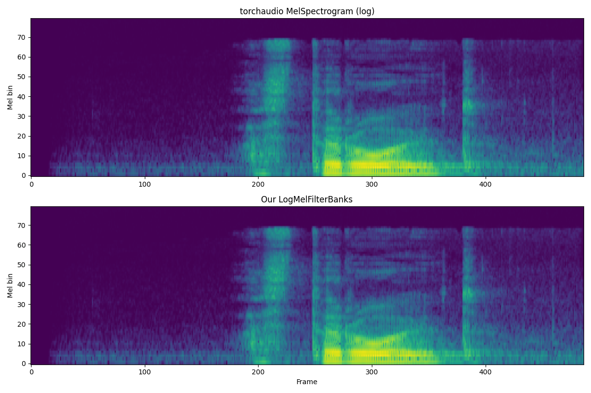
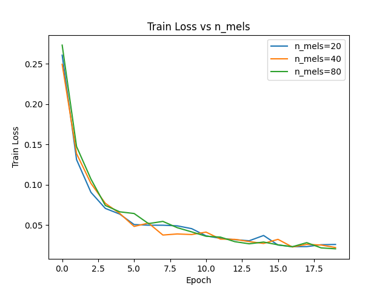
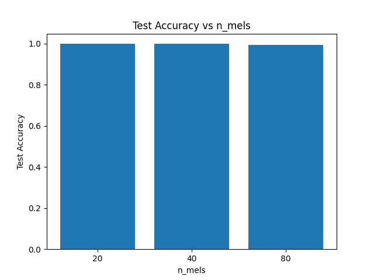
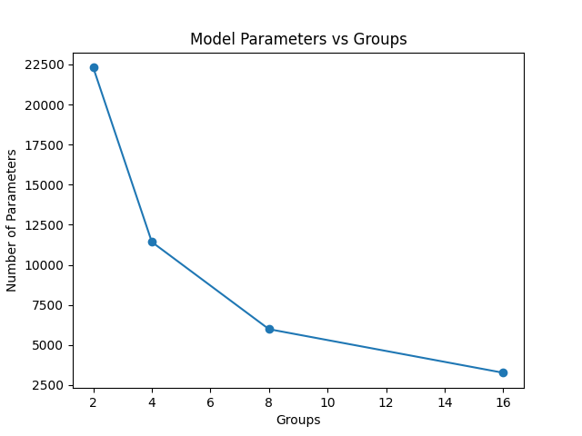
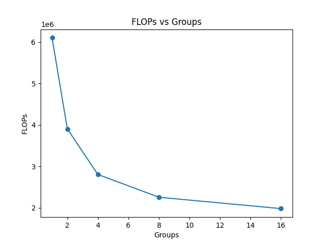
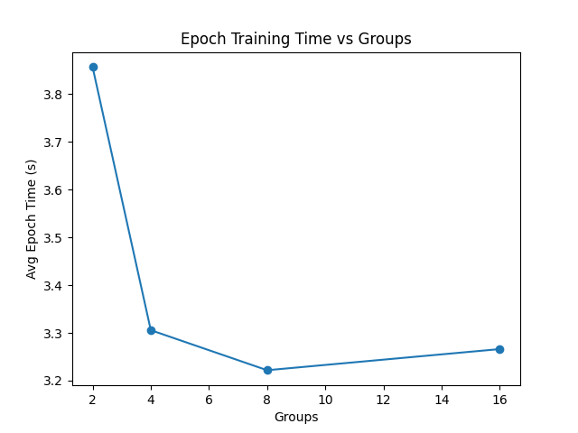

# Отчет по заданию 1. Цифровая обработка сигналов

## 1. Реализация LogMelFilterBanks

Реализован PyTorch-модуль `LogMelFilterBanks` для извлечения логарифмов энергий мел-фильтров. Модуль последовательно выполняет: STFT с окном Ханна, вычисление спектра мощности, мел-фильтрацию и логарифмирование

Реализация проверена на соответствие эталонному `torchaudio.transforms.MelSpectrogram` — оба assert (`shape` и `allclose`) проходят успешно

### Визуальное сравнение

Сравнение на произвольном аудиофайле (16 кГц): сверху — `torchaudio.MelSpectrogram` (с логарифмом), снизу — наша реализация. Спектрограммы визуально идентичны:



---

## 2. Архитектура модели

Модель SpeechCNN для бинарной классификации ("yes" / "no") на датасете Google Speech Commands. Три слоя Conv1d (32→64→64 каналов, kernel_size=5) с BatchNorm и ReLU, Global Average Pooling и линейный классификатор. На вход подаются LogMelFilterBanks-признаки

Обучение: Adam (lr=1e-3), batch size 64, 20 эпох, BCEWithLogitsLoss.
Данные: Train — 6358, Val — 803, Test — 824 сэмплов

---

## 3. Эксперименты с числом мел-фильтров (n_mels)

| n_mels | Параметры | Test Accuracy |
|--------|-----------|---------------|
| 20     | 34 465    | **99.51%**    |
| 40     | 37 665    | 99.64%        |
| 80     | 44 065    | 98.06%        |

### Логи обучения

<details>
<summary>n_mels=20</summary>

```
Epoch  1/20 | Loss: 0.2608 | Val Acc: 0.9676 | Time: 4.35s
Epoch  2/20 | Loss: 0.1312 | Val Acc: 0.9726 | Time: 2.20s
Epoch  3/20 | Loss: 0.0907 | Val Acc: 0.9763 | Time: 2.15s
Epoch  4/20 | Loss: 0.0708 | Val Acc: 0.9726 | Time: 2.26s
Epoch  5/20 | Loss: 0.0637 | Val Acc: 0.9589 | Time: 2.96s
Epoch  6/20 | Loss: 0.0507 | Val Acc: 0.9813 | Time: 2.12s
Epoch  7/20 | Loss: 0.0499 | Val Acc: 0.9875 | Time: 2.11s
Epoch  8/20 | Loss: 0.0499 | Val Acc: 0.9851 | Time: 2.13s
Epoch  9/20 | Loss: 0.0491 | Val Acc: 0.9863 | Time: 2.17s
Epoch 10/20 | Loss: 0.0457 | Val Acc: 0.9925 | Time: 2.83s
Epoch 11/20 | Loss: 0.0368 | Val Acc: 0.9900 | Time: 2.49s
Epoch 12/20 | Loss: 0.0336 | Val Acc: 0.9900 | Time: 2.18s
Epoch 13/20 | Loss: 0.0320 | Val Acc: 0.9801 | Time: 2.12s
Epoch 14/20 | Loss: 0.0306 | Val Acc: 0.9851 | Time: 2.25s
Epoch 15/20 | Loss: 0.0372 | Val Acc: 0.9888 | Time: 2.56s
Epoch 16/20 | Loss: 0.0253 | Val Acc: 0.9938 | Time: 2.75s
Epoch 17/20 | Loss: 0.0233 | Val Acc: 0.9913 | Time: 2.17s
Epoch 18/20 | Loss: 0.0234 | Val Acc: 0.9875 | Time: 2.17s
Epoch 19/20 | Loss: 0.0257 | Val Acc: 0.9913 | Time: 2.18s
Epoch 20/20 | Loss: 0.0261 | Val Acc: 0.9925 | Time: 2.38s
Test Acc: 0.9951
```
</details>

<details>
<summary>n_mels=40</summary>

```
Epoch  1/20 | Loss: 0.2495 | Val Acc: 0.9004 | Time: 3.02s
Epoch  2/20 | Loss: 0.1387 | Val Acc: 0.8979 | Time: 2.21s
Epoch  3/20 | Loss: 0.1018 | Val Acc: 0.9415 | Time: 2.27s
Epoch  4/20 | Loss: 0.0771 | Val Acc: 0.9738 | Time: 2.23s
Epoch  5/20 | Loss: 0.0646 | Val Acc: 0.9103 | Time: 2.26s
Epoch  6/20 | Loss: 0.0484 | Val Acc: 0.9776 | Time: 2.86s
Epoch  7/20 | Loss: 0.0526 | Val Acc: 0.9738 | Time: 2.21s
Epoch  8/20 | Loss: 0.0377 | Val Acc: 0.9838 | Time: 2.26s
Epoch  9/20 | Loss: 0.0391 | Val Acc: 0.9888 | Time: 2.27s
Epoch 10/20 | Loss: 0.0383 | Val Acc: 0.9589 | Time: 2.17s
Epoch 11/20 | Loss: 0.0414 | Val Acc: 0.9863 | Time: 2.78s
Epoch 12/20 | Loss: 0.0327 | Val Acc: 0.9714 | Time: 2.50s
Epoch 13/20 | Loss: 0.0324 | Val Acc: 0.9900 | Time: 2.21s
Epoch 14/20 | Loss: 0.0296 | Val Acc: 0.9838 | Time: 2.16s
Epoch 15/20 | Loss: 0.0273 | Val Acc: 0.9826 | Time: 2.23s
Epoch 16/20 | Loss: 0.0324 | Val Acc: 0.9851 | Time: 2.69s
Epoch 17/20 | Loss: 0.0229 | Val Acc: 0.9851 | Time: 2.77s
Epoch 18/20 | Loss: 0.0262 | Val Acc: 0.9863 | Time: 2.21s
Epoch 19/20 | Loss: 0.0253 | Val Acc: 0.9913 | Time: 2.18s
Epoch 20/20 | Loss: 0.0222 | Val Acc: 0.9913 | Time: 2.21s
Test Acc: 0.9964
```
</details>

<details>
<summary>n_mels=80</summary>

```
Epoch  1/20 | Loss: 0.2733 | Val Acc: 0.9340 | Time: 2.46s
Epoch  2/20 | Loss: 0.1475 | Val Acc: 0.9763 | Time: 2.80s
Epoch  3/20 | Loss: 0.1071 | Val Acc: 0.9838 | Time: 2.16s
Epoch  4/20 | Loss: 0.0744 | Val Acc: 0.9738 | Time: 2.20s
Epoch  5/20 | Loss: 0.0665 | Val Acc: 0.9863 | Time: 2.18s
Epoch  6/20 | Loss: 0.0644 | Val Acc: 0.9801 | Time: 2.39s
Epoch  7/20 | Loss: 0.0519 | Val Acc: 0.9651 | Time: 3.15s
Epoch  8/20 | Loss: 0.0547 | Val Acc: 0.9863 | Time: 2.24s
Epoch  9/20 | Loss: 0.0469 | Val Acc: 0.9738 | Time: 2.32s
Epoch 10/20 | Loss: 0.0417 | Val Acc: 0.9838 | Time: 2.34s
Epoch 11/20 | Loss: 0.0362 | Val Acc: 0.9875 | Time: 2.49s
Epoch 12/20 | Loss: 0.0352 | Val Acc: 0.9701 | Time: 3.09s
Epoch 13/20 | Loss: 0.0295 | Val Acc: 0.9888 | Time: 2.25s
Epoch 14/20 | Loss: 0.0269 | Val Acc: 0.9738 | Time: 2.21s
Epoch 15/20 | Loss: 0.0290 | Val Acc: 0.9863 | Time: 2.31s
Epoch 16/20 | Loss: 0.0256 | Val Acc: 0.9838 | Time: 2.23s
Epoch 17/20 | Loss: 0.0232 | Val Acc: 0.9863 | Time: 3.03s
Epoch 18/20 | Loss: 0.0283 | Val Acc: 0.9614 | Time: 2.36s
Epoch 19/20 | Loss: 0.0218 | Val Acc: 0.9863 | Time: 2.29s
Epoch 20/20 | Loss: 0.0207 | Val Acc: 0.9813 | Time: 2.29s
Test Acc: 0.9806
```
</details>

### Графики

| Train Loss | Test Accuracy |
|:---:|:---:|
|  |  |

### Выводы

- Все три варианта сходятся к похожим значениям loss (~0.02) за 20 эпох
- Для бинарной задачи (yes/no) даже 20 мел-фильтров достаточно для высокой точности (99.5%)
- Увеличение `n_mels` увеличивает количество параметров (за счет первого Conv1d-слоя), но не дает прироста качества
- Наилучший баланс: `n_mels=40` (99.64% при 37 665 параметрах)

---

## 4. Эксперименты с групповыми свертками (groups)

Базовая модель: `n_mels=80`, варьируется параметр `groups` в Conv1d-слоях.

| Groups | Параметры | FLOPs       | Test Accuracy |
|--------|-----------|-------------|---------------|
| 1      | 44 065    | 6 100 465   | 98.06%        |
| 2      | 22 305    | 3 902 705   | 98.67%        |
| 4      | 11 425    | 2 803 825   | **98.79%**    |
| 8      | 5 985     | 2 254 385   | 96.48%        |
| 16     | 3 265     | 1 979 665   | 96.36%        |

### Логи обучения

<details>
<summary>groups=2</summary>

```
Epoch  1/20 | Loss: 0.3178 | Val Acc: 0.9278 | Time: 2.81s
Epoch  2/20 | Loss: 0.1693 | Val Acc: 0.8630 | Time: 3.42s
Epoch  3/20 | Loss: 0.1270 | Val Acc: 0.9352 | Time: 2.64s
Epoch  4/20 | Loss: 0.1120 | Val Acc: 0.9328 | Time: 2.69s
Epoch  5/20 | Loss: 0.0918 | Val Acc: 0.6164 | Time: 2.69s
Epoch  6/20 | Loss: 0.0861 | Val Acc: 0.9738 | Time: 3.18s
Epoch  7/20 | Loss: 0.0781 | Val Acc: 0.9601 | Time: 2.83s
Epoch  8/20 | Loss: 0.0654 | Val Acc: 0.9676 | Time: 2.72s
Epoch  9/20 | Loss: 0.0582 | Val Acc: 0.9863 | Time: 2.66s
Epoch 10/20 | Loss: 0.0527 | Val Acc: 0.9763 | Time: 2.91s
Epoch 11/20 | Loss: 0.0498 | Val Acc: 0.9788 | Time: 3.15s
Epoch 12/20 | Loss: 0.0412 | Val Acc: 0.9813 | Time: 2.72s
Epoch 13/20 | Loss: 0.0425 | Val Acc: 0.9714 | Time: 2.71s
Epoch 14/20 | Loss: 0.0424 | Val Acc: 0.9788 | Time: 2.72s
Epoch 15/20 | Loss: 0.0497 | Val Acc: 0.9514 | Time: 3.50s
Epoch 16/20 | Loss: 0.0425 | Val Acc: 0.9875 | Time: 2.71s
Epoch 17/20 | Loss: 0.0343 | Val Acc: 0.9477 | Time: 2.73s
Epoch 18/20 | Loss: 0.0373 | Val Acc: 0.9601 | Time: 2.72s
Epoch 19/20 | Loss: 0.0353 | Val Acc: 0.9763 | Time: 3.15s
Epoch 20/20 | Loss: 0.0290 | Val Acc: 0.9888 | Time: 2.99s
Test Acc: 0.9867
```
</details>

<details>
<summary>groups=4</summary>

```
Epoch  1/20 | Loss: 0.4127 | Val Acc: 0.8667 | Time: 2.39s
Epoch  2/20 | Loss: 0.2278 | Val Acc: 0.9278 | Time: 2.32s
Epoch  3/20 | Loss: 0.1588 | Val Acc: 0.8879 | Time: 2.36s
Epoch  4/20 | Loss: 0.1234 | Val Acc: 0.9477 | Time: 3.03s
Epoch  5/20 | Loss: 0.1044 | Val Acc: 0.9689 | Time: 2.42s
Epoch  6/20 | Loss: 0.0920 | Val Acc: 0.7447 | Time: 2.33s
Epoch  7/20 | Loss: 0.0783 | Val Acc: 0.9278 | Time: 2.34s
Epoch  8/20 | Loss: 0.0693 | Val Acc: 0.7534 | Time: 2.43s
Epoch  9/20 | Loss: 0.0625 | Val Acc: 0.9689 | Time: 3.13s
Epoch 10/20 | Loss: 0.0671 | Val Acc: 0.9601 | Time: 2.34s
Epoch 11/20 | Loss: 0.0522 | Val Acc: 0.8194 | Time: 2.34s
Epoch 12/20 | Loss: 0.0493 | Val Acc: 0.9664 | Time: 2.39s
Epoch 13/20 | Loss: 0.0513 | Val Acc: 0.9539 | Time: 2.44s
Epoch 14/20 | Loss: 0.0454 | Val Acc: 0.9838 | Time: 3.04s
Epoch 15/20 | Loss: 0.0455 | Val Acc: 0.9340 | Time: 2.34s
Epoch 16/20 | Loss: 0.0409 | Val Acc: 0.9763 | Time: 2.43s
Epoch 17/20 | Loss: 0.0399 | Val Acc: 0.9813 | Time: 2.36s
Epoch 18/20 | Loss: 0.0333 | Val Acc: 0.9664 | Time: 2.50s
Epoch 19/20 | Loss: 0.0326 | Val Acc: 0.9826 | Time: 3.02s
Epoch 20/20 | Loss: 0.0267 | Val Acc: 0.9913 | Time: 2.35s
Test Acc: 0.9879
```
</details>

<details>
<summary>groups=8</summary>

```
Epoch  1/20 | Loss: 0.5080 | Val Acc: 0.7671 | Time: 2.26s
Epoch  2/20 | Loss: 0.3283 | Val Acc: 0.8991 | Time: 2.25s
Epoch  3/20 | Loss: 0.2443 | Val Acc: 0.9178 | Time: 2.45s
Epoch  4/20 | Loss: 0.2047 | Val Acc: 0.9191 | Time: 2.94s
Epoch  5/20 | Loss: 0.1811 | Val Acc: 0.9303 | Time: 2.26s
Epoch  6/20 | Loss: 0.1572 | Val Acc: 0.7696 | Time: 2.24s
Epoch  7/20 | Loss: 0.1472 | Val Acc: 0.9601 | Time: 2.21s
Epoch  8/20 | Loss: 0.1316 | Val Acc: 0.9340 | Time: 2.25s
Epoch  9/20 | Loss: 0.1258 | Val Acc: 0.9564 | Time: 3.01s
Epoch 10/20 | Loss: 0.1152 | Val Acc: 0.9489 | Time: 2.20s
Epoch 11/20 | Loss: 0.1048 | Val Acc: 0.9514 | Time: 2.20s
Epoch 12/20 | Loss: 0.1006 | Val Acc: 0.9552 | Time: 2.21s
Epoch 13/20 | Loss: 0.0935 | Val Acc: 0.9751 | Time: 2.14s
Epoch 14/20 | Loss: 0.0874 | Val Acc: 0.9689 | Time: 2.89s
Epoch 15/20 | Loss: 0.0807 | Val Acc: 0.9539 | Time: 2.43s
Epoch 16/20 | Loss: 0.0784 | Val Acc: 0.9738 | Time: 2.21s
Epoch 17/20 | Loss: 0.0756 | Val Acc: 0.9738 | Time: 2.23s
Epoch 18/20 | Loss: 0.0702 | Val Acc: 0.9016 | Time: 2.27s
Epoch 19/20 | Loss: 0.0695 | Val Acc: 0.9738 | Time: 2.82s
Epoch 20/20 | Loss: 0.0728 | Val Acc: 0.9664 | Time: 2.54s
Test Acc: 0.9648
```
</details>

<details>
<summary>groups=16</summary>

```
Epoch  1/20 | Loss: 0.5411 | Val Acc: 0.8804 | Time: 2.25s
Epoch  2/20 | Loss: 0.3644 | Val Acc: 0.8929 | Time: 2.27s
Epoch  3/20 | Loss: 0.2788 | Val Acc: 0.9078 | Time: 2.23s
Epoch  4/20 | Loss: 0.2351 | Val Acc: 0.8468 | Time: 2.78s
Epoch  5/20 | Loss: 0.2100 | Val Acc: 0.9215 | Time: 2.62s
Epoch  6/20 | Loss: 0.1913 | Val Acc: 0.9265 | Time: 2.26s
Epoch  7/20 | Loss: 0.1694 | Val Acc: 0.9166 | Time: 2.27s
Epoch  8/20 | Loss: 0.1602 | Val Acc: 0.9390 | Time: 2.26s
Epoch  9/20 | Loss: 0.1482 | Val Acc: 0.9489 | Time: 2.76s
Epoch 10/20 | Loss: 0.1347 | Val Acc: 0.9452 | Time: 2.74s
Epoch 11/20 | Loss: 0.1308 | Val Acc: 0.9215 | Time: 2.26s
Epoch 12/20 | Loss: 0.1199 | Val Acc: 0.9228 | Time: 2.29s
Epoch 13/20 | Loss: 0.1111 | Val Acc: 0.9502 | Time: 2.23s
Epoch 14/20 | Loss: 0.1075 | Val Acc: 0.9402 | Time: 2.69s
Epoch 15/20 | Loss: 0.0993 | Val Acc: 0.9228 | Time: 2.75s
Epoch 16/20 | Loss: 0.0972 | Val Acc: 0.9564 | Time: 2.23s
Epoch 17/20 | Loss: 0.0896 | Val Acc: 0.9639 | Time: 2.27s
Epoch 18/20 | Loss: 0.0852 | Val Acc: 0.9676 | Time: 2.18s
Epoch 19/20 | Loss: 0.0854 | Val Acc: 0.9552 | Time: 2.51s
Epoch 20/20 | Loss: 0.0839 | Val Acc: 0.9415 | Time: 2.90s
Test Acc: 0.9636
```
</details>

### Графики

| Параметры vs Groups | FLOPs vs Groups | Время обучения vs Groups |
|:---:|:---:|:---:|
|  |  |  |

### Выводы

- **Параметры и FLOPs** уменьшаются с ростом groups. При `groups=16` параметров в ~13.5 раз меньше, а FLOPs в ~3 раза меньше, чем при `groups=1`
- **Точность** остается высокой при `groups=2` и `groups=4` (>98%), но снижается при `groups=8` и `groups=16` (~96.4%) — групповые свертки ограничивают взаимодействие между каналами
- **Время обучения** уменьшается с ~2.9с до ~2.4с на эпоху, но выигрыш невелик — при малом размере модели накладные расходы GPU доминируют
- Оптимальный компромисс: `groups=4` — уменьшение параметров в ~4 раза при сохранении высокой точности (98.79%)

---

## Воспроизведение результатов

```bash
pip install torch torchaudio soundfile ptflops matplotlib
```

**Проверка LogMelFilterBanks (Part 1):**
```bash
cd assignments/assignment1
python test_melbanks.py
```

**Обучение модели и эксперименты (Parts 2-4):**
```bash
cd assignments/assignment1
python train.py
```

Скрипт `train.py` автоматически скачает датасет Google Speech Commands в `./data/`, проведет все эксперименты (n_mels и groups) и сохранит графики в PNG-файлы.

Обучение проводилось на RTX 4070 Super. Полное время выполнения ~20-30 мин.

---

## Общие выводы

1. Реализация `LogMelFilterBanks` полностью совпадает с эталонной `torchaudio.MelSpectrogram`
2. Для бинарной задачи (yes/no) компактная CNN-модель (<50K параметров) достигает точности >98%
3. Групповые свертки — эффективный способ уменьшения параметров и FLOPs с умеренной потерей качества
4. Оптимальная конфигурация по соотношению качество/эффективность: `n_mels=40`, `groups=4`
