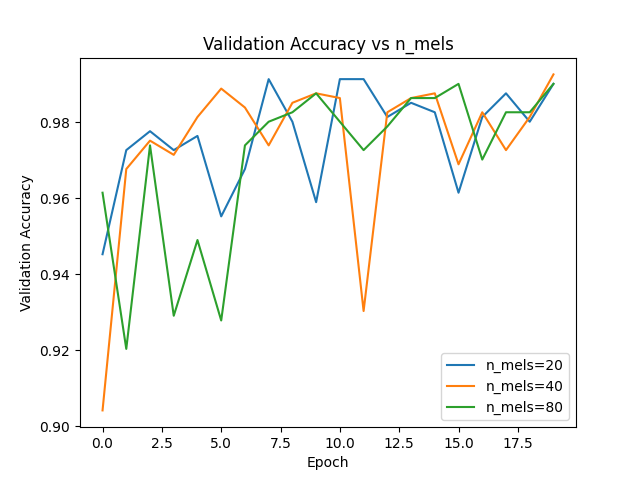
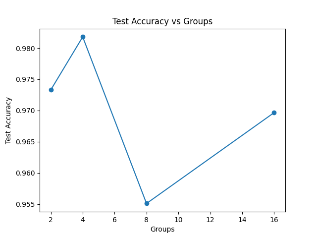

# Отчет по заданию 1. Цифровая обработка сигналов

## 1. Реализация LogMelFilterBanks

Реализован PyTorch-модуль `LogMelFilterBanks` для извлечения логарифмов энергий мел-фильтров. Модуль последовательно выполняет: STFT с окном Ханна, вычисление спектра мощности, мел-фильтрацию и логарифмирование

Реализация проверена на соответствие эталонному `torchaudio.transforms.MelSpectrogram` — оба assert (`shape` и `allclose`) проходят успешно

### Визуальное сравнение

Сравнение на произвольном аудиофайле (16 кГц): сверху — `torchaudio.MelSpectrogram` (с логарифмом), снизу — наша реализация. Спектрограммы визуально идентичны:


---

## 2. Архитектура модели

Модель SpeechCNN для бинарной классификации ("yes" / "no") на датасете Google Speech Commands. Три слоя Conv1d (32→64→64 каналов, kernel_size=5) с BatchNorm и ReLU, Global Average Pooling и линейный классификатор. На вход подаются LogMelFilterBanks-признаки

Обучение: Adam (lr=1e-3), batch size 64, 20 эпох, BCEWithLogitsLoss.
Данные: Train — 6358, Val — 803, Test — 824 сэмплов

---

## 3. Эксперименты с числом мел-фильтров (n_mels)

| n_mels | Параметры | Test Accuracy |
|--------|-----------|---------------|
| 20     | 34 465    | **99.88%**    |
| 40     | 37 665    | **99.88%**    |
| 80     | 44 065    | 99.39%        |

### Логи обучения

<details>
<summary>n_mels=20</summary>

```
Epoch  1/20 | Loss: 0.2540 | Val Acc: 0.9452 | Time: 31.79s
Epoch  2/20 | Loss: 0.1256 | Val Acc: 0.9726 | Time: 3.41s
Epoch  3/20 | Loss: 0.0981 | Val Acc: 0.9776 | Time: 3.43s
Epoch  4/20 | Loss: 0.0811 | Val Acc: 0.9726 | Time: 3.41s
Epoch  5/20 | Loss: 0.0611 | Val Acc: 0.9763 | Time: 3.37s
Epoch  6/20 | Loss: 0.0540 | Val Acc: 0.9552 | Time: 3.39s
Epoch  7/20 | Loss: 0.0508 | Val Acc: 0.9676 | Time: 3.41s
Epoch  8/20 | Loss: 0.0434 | Val Acc: 0.9913 | Time: 3.61s
Epoch  9/20 | Loss: 0.0394 | Val Acc: 0.9801 | Time: 3.68s
Epoch 10/20 | Loss: 0.0509 | Val Acc: 0.9589 | Time: 3.50s
Epoch 11/20 | Loss: 0.0401 | Val Acc: 0.9913 | Time: 3.68s
Epoch 12/20 | Loss: 0.0320 | Val Acc: 0.9913 | Time: 3.66s
Epoch 13/20 | Loss: 0.0467 | Val Acc: 0.9813 | Time: 3.67s
Epoch 14/20 | Loss: 0.0387 | Val Acc: 0.9851 | Time: 3.75s
Epoch 15/20 | Loss: 0.0346 | Val Acc: 0.9826 | Time: 3.65s
Epoch 16/20 | Loss: 0.0275 | Val Acc: 0.9614 | Time: 3.64s
Epoch 17/20 | Loss: 0.0329 | Val Acc: 0.9813 | Time: 3.84s
Epoch 18/20 | Loss: 0.0310 | Val Acc: 0.9875 | Time: 3.66s
Epoch 19/20 | Loss: 0.0268 | Val Acc: 0.9801 | Time: 3.56s
Epoch 20/20 | Loss: 0.0302 | Val Acc: 0.9900 | Time: 3.03s
Test Acc: 0.9988
```
</details>

<details>
<summary>n_mels=40</summary>

```
Epoch  1/20 | Loss: 0.2749 | Val Acc: 0.9041 | Time: 3.79s
Epoch  2/20 | Loss: 0.1380 | Val Acc: 0.9676 | Time: 3.72s
Epoch  3/20 | Loss: 0.0979 | Val Acc: 0.9751 | Time: 3.77s
Epoch  4/20 | Loss: 0.0788 | Val Acc: 0.9714 | Time: 3.74s
Epoch  5/20 | Loss: 0.0609 | Val Acc: 0.9813 | Time: 3.83s
Epoch  6/20 | Loss: 0.0582 | Val Acc: 0.9888 | Time: 3.18s
Epoch  7/20 | Loss: 0.0510 | Val Acc: 0.9838 | Time: 3.67s
Epoch  8/20 | Loss: 0.0420 | Val Acc: 0.9738 | Time: 3.22s
Epoch  9/20 | Loss: 0.0364 | Val Acc: 0.9851 | Time: 3.38s
Epoch 10/20 | Loss: 0.0368 | Val Acc: 0.9875 | Time: 3.68s
Epoch 11/20 | Loss: 0.0388 | Val Acc: 0.9863 | Time: 3.59s
Epoch 12/20 | Loss: 0.0317 | Val Acc: 0.9303 | Time: 3.59s
Epoch 13/20 | Loss: 0.0251 | Val Acc: 0.9826 | Time: 3.64s
Epoch 14/20 | Loss: 0.0264 | Val Acc: 0.9863 | Time: 3.17s
Epoch 15/20 | Loss: 0.0270 | Val Acc: 0.9875 | Time: 3.30s
Epoch 16/20 | Loss: 0.0296 | Val Acc: 0.9689 | Time: 3.17s
Epoch 17/20 | Loss: 0.0228 | Val Acc: 0.9826 | Time: 3.19s
Epoch 18/20 | Loss: 0.0287 | Val Acc: 0.9726 | Time: 3.42s
Epoch 19/20 | Loss: 0.0269 | Val Acc: 0.9813 | Time: 3.30s
Epoch 20/20 | Loss: 0.0238 | Val Acc: 0.9925 | Time: 3.35s
Test Acc: 0.9988
```
</details>

<details>
<summary>n_mels=80</summary>

```
Epoch  1/20 | Loss: 0.2510 | Val Acc: 0.9614 | Time: 3.19s
Epoch  2/20 | Loss: 0.1261 | Val Acc: 0.9203 | Time: 3.24s
Epoch  3/20 | Loss: 0.0960 | Val Acc: 0.9738 | Time: 3.53s
Epoch  4/20 | Loss: 0.0859 | Val Acc: 0.9290 | Time: 3.21s
Epoch  5/20 | Loss: 0.0711 | Val Acc: 0.9489 | Time: 3.29s
Epoch  6/20 | Loss: 0.0599 | Val Acc: 0.9278 | Time: 3.20s
Epoch  7/20 | Loss: 0.0641 | Val Acc: 0.9738 | Time: 3.24s
Epoch  8/20 | Loss: 0.0469 | Val Acc: 0.9801 | Time: 3.28s
Epoch  9/20 | Loss: 0.0508 | Val Acc: 0.9826 | Time: 3.50s
Epoch 10/20 | Loss: 0.0449 | Val Acc: 0.9875 | Time: 3.70s
Epoch 11/20 | Loss: 0.0343 | Val Acc: 0.9801 | Time: 3.58s
Epoch 12/20 | Loss: 0.0447 | Val Acc: 0.9726 | Time: 3.45s
Epoch 13/20 | Loss: 0.0399 | Val Acc: 0.9788 | Time: 3.41s
Epoch 14/20 | Loss: 0.0374 | Val Acc: 0.9863 | Time: 3.46s
Epoch 15/20 | Loss: 0.0299 | Val Acc: 0.9863 | Time: 3.45s
Epoch 16/20 | Loss: 0.0305 | Val Acc: 0.9900 | Time: 3.41s
Epoch 17/20 | Loss: 0.0289 | Val Acc: 0.9701 | Time: 3.69s
Epoch 18/20 | Loss: 0.0289 | Val Acc: 0.9826 | Time: 3.76s
Epoch 19/20 | Loss: 0.0247 | Val Acc: 0.9826 | Time: 3.74s
Epoch 20/20 | Loss: 0.0243 | Val Acc: 0.9900 | Time: 3.72s
Test Acc: 0.9939
```
</details>

### Графики

| Train Loss | Validation Accuracy | Test Accuracy |
|:---:|:---:|:---:|
|  |  |  |

### Выводы

- Все три варианта сходятся к похожим значениям loss (~0.02–0.03) за 20 эпох
- Для бинарной задачи (yes/no) даже 20 мел-фильтров достаточно для высокой точности (99.88%)
- Увеличение `n_mels` увеличивает количество параметров (за счет первого Conv1d-слоя), но не дает прироста качества
- n_mels=20 и n_mels=40 показывают одинаковую точность (99.88%), n_mels=80 немного ниже (99.39%)

---

### Выбор базовой модели

В качестве базовой модели для экспериментов с групповыми свертками выбрана конфигурация **n_mels=80** (44 065 параметров, 99.39% test accuracy). Несмотря на то, что n_mels=20 и n_mels=40 показывают чуть лучшую точность, n_mels=80 обеспечивает наиболее детальное спектральное представление и является стандартом

---

## 4. Эксперименты с групповыми свертками (groups)

Базовая модель: `n_mels=80`, варьируется параметр `groups` в Conv1d-слоях.

| Groups | Параметры | FLOPs       | Test Accuracy |
|--------|-----------|-------------|---------------|
| 1      | 44 065    | 6 100 465   | 99.39%        |
| 2      | 22 305    | 3 902 705   | 97.33%        |
| 4      | 11 425    | 2 803 825   | **98.18%**    |
| 8      | 5 985     | 2 254 385   | 95.51%        |
| 16     | 3 265     | 1 979 665   | 96.97%        |

### Логи обучения

<details>
<summary>groups=2</summary>

```
Epoch  1/20 | Loss: 0.3116 | Val Acc: 0.8742 | Time: 3.35s
Epoch  2/20 | Loss: 0.1638 | Val Acc: 0.8842 | Time: 3.40s
Epoch  3/20 | Loss: 0.1143 | Val Acc: 0.8730 | Time: 4.08s
Epoch  4/20 | Loss: 0.0916 | Val Acc: 0.9676 | Time: 3.42s
Epoch  5/20 | Loss: 0.0821 | Val Acc: 0.9639 | Time: 3.54s
Epoch  6/20 | Loss: 0.0646 | Val Acc: 0.9776 | Time: 4.29s
Epoch  7/20 | Loss: 0.0625 | Val Acc: 0.8132 | Time: 4.02s
Epoch  8/20 | Loss: 0.0576 | Val Acc: 0.9801 | Time: 4.03s
Epoch  9/20 | Loss: 0.0489 | Val Acc: 0.9851 | Time: 4.01s
Epoch 10/20 | Loss: 0.0449 | Val Acc: 0.9813 | Time: 4.06s
Epoch 11/20 | Loss: 0.0498 | Val Acc: 0.9626 | Time: 4.03s
Epoch 12/20 | Loss: 0.0485 | Val Acc: 0.9763 | Time: 4.08s
Epoch 13/20 | Loss: 0.0502 | Val Acc: 0.9925 | Time: 4.03s
Epoch 14/20 | Loss: 0.0380 | Val Acc: 0.9851 | Time: 4.07s
Epoch 15/20 | Loss: 0.0365 | Val Acc: 0.9813 | Time: 4.15s
Epoch 16/20 | Loss: 0.0358 | Val Acc: 0.9851 | Time: 4.10s
Epoch 17/20 | Loss: 0.0336 | Val Acc: 0.9875 | Time: 3.44s
Epoch 18/20 | Loss: 0.0308 | Val Acc: 0.9913 | Time: 3.22s
Epoch 19/20 | Loss: 0.0352 | Val Acc: 0.9539 | Time: 3.81s
Epoch 20/20 | Loss: 0.0246 | Val Acc: 0.9726 | Time: 3.49s
Test Acc: 0.9733
```
</details>

<details>
<summary>groups=4</summary>

```
Epoch  1/20 | Loss: 0.4033 | Val Acc: 0.9153 | Time: 3.29s
Epoch  2/20 | Loss: 0.2225 | Val Acc: 0.8979 | Time: 3.50s
Epoch  3/20 | Loss: 0.1632 | Val Acc: 0.9626 | Time: 3.59s
Epoch  4/20 | Loss: 0.1274 | Val Acc: 0.9614 | Time: 3.76s
Epoch  5/20 | Loss: 0.1044 | Val Acc: 0.9651 | Time: 3.41s
Epoch  6/20 | Loss: 0.0939 | Val Acc: 0.9166 | Time: 3.63s
Epoch  7/20 | Loss: 0.0829 | Val Acc: 0.9290 | Time: 3.19s
Epoch  8/20 | Loss: 0.0779 | Val Acc: 0.9614 | Time: 3.20s
Epoch  9/20 | Loss: 0.0674 | Val Acc: 0.8680 | Time: 3.10s
Epoch 10/20 | Loss: 0.0650 | Val Acc: 0.9041 | Time: 3.22s
Epoch 11/20 | Loss: 0.0617 | Val Acc: 0.9788 | Time: 3.06s
Epoch 12/20 | Loss: 0.0540 | Val Acc: 0.9278 | Time: 3.22s
Epoch 13/20 | Loss: 0.0588 | Val Acc: 0.9813 | Time: 3.45s
Epoch 14/20 | Loss: 0.0533 | Val Acc: 0.9801 | Time: 3.09s
Epoch 15/20 | Loss: 0.0482 | Val Acc: 0.9751 | Time: 3.29s
Epoch 16/20 | Loss: 0.0398 | Val Acc: 0.9290 | Time: 3.09s
Epoch 17/20 | Loss: 0.0487 | Val Acc: 0.9838 | Time: 3.22s
Epoch 18/20 | Loss: 0.0489 | Val Acc: 0.9788 | Time: 3.07s
Epoch 19/20 | Loss: 0.0395 | Val Acc: 0.9763 | Time: 3.28s
Epoch 20/20 | Loss: 0.0346 | Val Acc: 0.9776 | Time: 3.46s
Test Acc: 0.9818
```
</details>

<details>
<summary>groups=8</summary>

```
Epoch  1/20 | Loss: 0.4766 | Val Acc: 0.8804 | Time: 3.12s
Epoch  2/20 | Loss: 0.2917 | Val Acc: 0.8954 | Time: 3.33s
Epoch  3/20 | Loss: 0.2182 | Val Acc: 0.9502 | Time: 3.10s
Epoch  4/20 | Loss: 0.1742 | Val Acc: 0.9415 | Time: 3.21s
Epoch  5/20 | Loss: 0.1479 | Val Acc: 0.9552 | Time: 3.06s
Epoch  6/20 | Loss: 0.1296 | Val Acc: 0.9390 | Time: 3.16s
Epoch  7/20 | Loss: 0.1097 | Val Acc: 0.9639 | Time: 3.29s
Epoch  8/20 | Loss: 0.1064 | Val Acc: 0.9564 | Time: 3.28s
Epoch  9/20 | Loss: 0.0989 | Val Acc: 0.9477 | Time: 3.35s
Epoch 10/20 | Loss: 0.0862 | Val Acc: 0.9689 | Time: 3.42s
Epoch 11/20 | Loss: 0.0812 | Val Acc: 0.9639 | Time: 3.54s
Epoch 12/20 | Loss: 0.0830 | Val Acc: 0.9763 | Time: 3.26s
Epoch 13/20 | Loss: 0.0758 | Val Acc: 0.9726 | Time: 3.22s
Epoch 14/20 | Loss: 0.0680 | Val Acc: 0.9676 | Time: 3.20s
Epoch 15/20 | Loss: 0.0691 | Val Acc: 0.9801 | Time: 3.12s
Epoch 16/20 | Loss: 0.0637 | Val Acc: 0.9751 | Time: 3.10s
Epoch 17/20 | Loss: 0.0621 | Val Acc: 0.9415 | Time: 3.19s
Epoch 18/20 | Loss: 0.0671 | Val Acc: 0.9427 | Time: 3.17s
Epoch 19/20 | Loss: 0.0615 | Val Acc: 0.9788 | Time: 3.12s
Epoch 20/20 | Loss: 0.0586 | Val Acc: 0.9614 | Time: 3.12s
Test Acc: 0.9551
```
</details>

<details>
<summary>groups=16</summary>

```
Epoch  1/20 | Loss: 0.5865 | Val Acc: 0.8381 | Time: 3.31s
Epoch  2/20 | Loss: 0.4281 | Val Acc: 0.7908 | Time: 3.16s
Epoch  3/20 | Loss: 0.3291 | Val Acc: 0.8979 | Time: 3.20s
Epoch  4/20 | Loss: 0.2709 | Val Acc: 0.8605 | Time: 3.15s
Epoch  5/20 | Loss: 0.2403 | Val Acc: 0.8954 | Time: 3.19s
Epoch  6/20 | Loss: 0.2085 | Val Acc: 0.8755 | Time: 3.28s
Epoch  7/20 | Loss: 0.1893 | Val Acc: 0.8331 | Time: 3.23s
Epoch  8/20 | Loss: 0.1760 | Val Acc: 0.9166 | Time: 3.21s
Epoch  9/20 | Loss: 0.1645 | Val Acc: 0.9091 | Time: 3.25s
Epoch 10/20 | Loss: 0.1591 | Val Acc: 0.9278 | Time: 3.21s
Epoch 11/20 | Loss: 0.1437 | Val Acc: 0.7808 | Time: 3.17s
Epoch 12/20 | Loss: 0.1428 | Val Acc: 0.9377 | Time: 3.19s
Epoch 13/20 | Loss: 0.1363 | Val Acc: 0.9477 | Time: 3.29s
Epoch 14/20 | Loss: 0.1259 | Val Acc: 0.9415 | Time: 3.58s
Epoch 15/20 | Loss: 0.1226 | Val Acc: 0.9614 | Time: 3.22s
Epoch 16/20 | Loss: 0.1220 | Val Acc: 0.9477 | Time: 3.52s
Epoch 17/20 | Loss: 0.1136 | Val Acc: 0.9340 | Time: 3.29s
Epoch 18/20 | Loss: 0.1102 | Val Acc: 0.9489 | Time: 3.29s
Epoch 19/20 | Loss: 0.1059 | Val Acc: 0.9589 | Time: 3.21s
Epoch 20/20 | Loss: 0.1014 | Val Acc: 0.9589 | Time: 3.42s
Test Acc: 0.9697
```
</details>

### Графики

| Параметры vs Groups | FLOPs vs Groups |
|:---:|:---:|
|  |  |

| Время обучения vs Groups | Test Accuracy vs Groups |
|:---:|:---:|
|  |  |

### Выводы

- **Параметры и FLOPs** уменьшаются с ростом groups. При `groups=16` параметров в ~13.5 раз меньше, а FLOPs в ~3 раза меньше, чем при `groups=1`
- **Точность** остается высокой при `groups=4` (98.18%), но снижается при `groups=8` (95.51%) — групповые свертки ограничивают взаимодействие между каналами
- **Время обучения** уменьшается с ~3.9с до ~3.2с на эпоху, но выигрыш невелик — при малом размере модели накладные расходы GPU доминируют
- Оптимальный компромисс: `groups=4` — уменьшение параметров в ~4 раза при сохранении высокой точности (98.18%)

---

## Воспроизведение результатов

```bash
pip install torch torchaudio soundfile ptflops matplotlib
```

**Проверка LogMelFilterBanks (Part 1):**
```bash
cd assignments/assignment1
python test_melbanks.py
```

**Обучение модели и эксперименты (Parts 2-4):**
```bash
cd assignments/assignment1
python train.py
```

Скрипт `train.py` автоматически скачает датасет Google Speech Commands в `./data/`, прогонит все эксперименты (n_mels и groups) и сохранит графики в PNG-файлы

Обучение проводилось на RTX 4070 Super. Полное время прогона ~7 минут

---

## Общие выводы

1. Реализация `LogMelFilterBanks` полностью совпадает с эталонной `torchaudio.MelSpectrogram`
2. Для бинарной задачи (yes/no) компактная CNN-модель (<50K параметров) достигает точности >99%
3. Групповые свертки — эффективный способ уменьшения параметров и FLOPs с умеренной потерей качества
4. Оптимальная конфигурация по соотношению качество/эффективность: `n_mels=80`, `groups=4`
