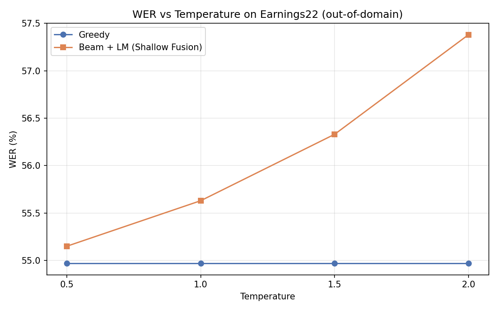
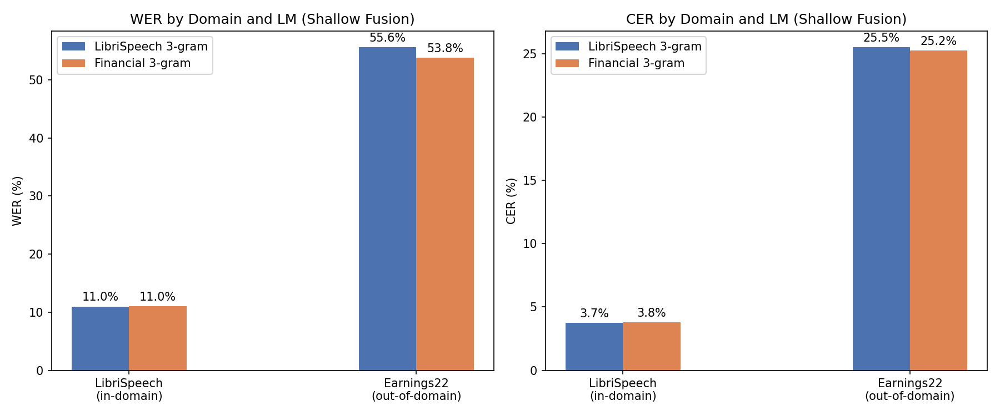
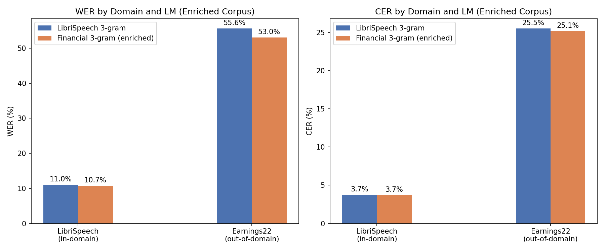

# Отчет по заданию 2. ASR Decoding

## Структура проекта

| Файл | Описание |
|---|---|
| `wav2vec2decoder.py` | Основной класс декодера с реализацией 4 методов: greedy, beam search, shallow fusion, LM rescoring |
| `eval/eval_task2.py` | Sweep по beam_width на LibriSpeech |
| `eval/eval_task3.py` | Sweep по температуре (greedy) на LibriSpeech |
| `eval/eval_task4.py` | Sweep по alpha/beta (shallow fusion) на LibriSpeech |
| `eval/eval_task5.py` | Сравнение 3-gram и 4-gram LM на LibriSpeech |
| `eval/eval_task6.py` | Sweep по alpha/beta (rescoring) на LibriSpeech |
| `eval/eval_task6_qualitative.py` | Качественное сравнение beam/SF/RS на 10 примерах |
| `eval/eval_task7.py` | Cross-domain evaluation (все методы на LibriSpeech + Earnings22) |
| `eval/eval_task7b.py` | Sweep по температуре с greedy и SF на Earnings22 |
| `eval/eval_task9.py` | Сравнение LibriSpeech LM и Financial LM на обоих доменах |
| `extend_corpus_news.py` | Скачивание датасета с финансовыми новостями c HF для расширения корпуса LM |
| `plot_task7b.py` | График WER vs Temperature |
| `plot_task9.py` | График сравнения LM — исходный корпус |
| `plot_task9_enriched.py` | График сравнения LM — расширенный корпус |

### Как получить финансовую LM, обученную на расширенном датасете

```bash
# 1. Расширить корпус
python extend_corpus_news.py

# 2. Обучить LM
/tmp/kenlm_build/build/bin/lmplz -o 3 --discount_fallback \
    < data/earnings22_train/corpus.txt > /tmp/financial-3gram.arpa
gzip -c /tmp/financial-3gram.arpa > lm/financial-3gram.arpa.gz
```

## Part 1 — CTC Decoding

### Task 1. Greedy Decode

Результаты на `data/librispeech_test_other/`:

| Метрика | Наш результат | Reference |
|---|---|---|
| WER | 11.22% | ≈ 10.4% |
| CER | 3.81% | ≈ 3.5% |

### Task 2. Beam Search Decode

Результаты на `data/librispeech_test_other/` при разных значениях beam_width:

| Beam Width | WER | CER |
|---|---|---|
| 1 | 11.24% | 3.80% |
| 3 | 11.15% | 3.78% |
| 5 | **11.05%** | **3.74%** |
| 10 | 11.07% | 3.77% |

Интересно, что при beam_width=5 получились наилучшие результаты. При beam_width=10 больше менее вероятных путей конкурируют с лучшими, из-за чего метрики чуть хуже. beam_width=1 (11.24%) почти совпадает с greedy (11.22%), что ожидаемо, т.к. beam search с beam_width=1 по сути эквивалентен greedy decoding

### Task 3. Temperature Scaling

Результаты greedy decoding на `data/librispeech_test_other/` при разных температурах:

| Temperature | WER | CER |
|---|---|---|
| 0.5 | 11.22% | 3.81% |
| 0.8 | 11.22% | 3.81% |
| 1.0 | 11.22% | 3.81% |
| 1.2 | 11.22% | 3.81% |
| 1.5 | 11.22% | 3.81% |
| 2.0 | 11.22% | 3.81% |

Температура не влияет на greedy decoding, потому что деление логитов на T не меняет порядок значений, а значит argmax выбирает тот же токен при любом T

## Part 2 — Language Model Integration

### Task 4. Shallow Fusion (beam_search_with_lm)

Sweep по alpha и beta на `data/librispeech_test_other/` (beam_width=5, 3-gram LM):

| alpha \ beta | 0.0 | 0.5 | 1.0 | 1.5 |
|---|---|---|---|---|
| 0.01 | 11.05% | **10.98%** | 11.12% | 11.32% |
| 0.05 | 11.05% | **10.98%** | 11.15% | 11.32% |
| 0.10 | 11.05% | **10.98%** | 11.05% | 11.29% |
| 0.50 | 11.39% | 11.10% | **10.98%** | 11.00% |
| 1.00 | 11.59% | 11.61% | 11.27% | 11.05% |
| 2.00 | 13.52% | 12.52% | 12.15% | 11.68% |
| 5.00 | 51.75% | 45.49% | 42.34% | 39.79% |

Лучшая конфигурация: **alpha=0.05, beta=0.5 → WER=10.98%, CER=3.73%**

При малых alpha LM почти не влияет. При очень больших alpha (5.0) LM полностью доминирует и качество резко падает (WER до 51.75%). Акустическая модель и так хорошо работает на LibriSpeech (in-domain), поэтому оптимальный alpha очень небольшой

### Task 5. 3-gram vs 4-gram LM

Результаты на `data/librispeech_test_other/` с лучшими параметрами (alpha=0.05, beta=0.5):

| LM | WER | CER |
|---|---|---|
| 3-gram | 10.98% | 3.73% |
| 4-gram | 10.98% | 3.73% |

Результаты идентичны. При таком малом alpha (0.05) влияние LM минимально, и разница между 3-gram и 4-gram не проявляется

### Task 6. LM Rescoring

Sweep по alpha и beta для rescoring на `data/librispeech_test_other/` (beam_width=5, 3-gram LM):

| alpha \ beta | 0.0 | 0.5 | 1.0 | 1.5 |
|---|---|---|---|---|
| 0.01 | 11.05% | 11.00% | 11.07% | 11.22% |
| 0.05 | 11.05% | 11.02% | 11.07% | 11.22% |
| 0.10 | 11.05% | 11.02% | 11.05% | 11.22% |
| 0.50 | 11.10% | 11.00% | 10.98% | 11.05% |
| 1.00 | 11.22% | 11.02% | **10.98%** | **10.98%** |
| 2.00 | 11.54% | 11.22% | 11.07% | **10.98%** |
| 5.00 | 12.03% | 11.61% | 11.22% | 11.05% |

Rescoring значительно более стабилен при больших alpha: при alpha=5.0 WER=12.03% vs 51.75% у shallow fusion. Это объясняется тем, что rescoring лишь переранжирует уже найденные beam search гипотезы, а shallow fusion использует LM во время поиска, что при большом alpha искажает поиск

#### Качественное сравнение

Примеры, где методы дают разные результаты:

**LM исправляет границы слов:**

| # | REF | BEAM | SF | RS |
|---|---|---|---|---|
| 1 | might **do it** | might **doit** | might **do it** ✓ | might **doit** |
| 2 | mister **gurr father** | mister **gurfather** | mister **gur father** ✓ | mister **gur father** ✓ |
| 3 | course **well armed** | course **willarmed** | course **will armed** ✓ | course **will amed** |
| 6 | the **crew sprang** in | the **crewsprang** in | the **crewsprang** in | the **crew sprang** in ✓ |
| 8 | after **a little** | after **little** | after **a little** ✓ | after **little** |

**LM ухудшает результат + разногласие между SF и RS:**

| # | Лучший вариант | LM вариант | Проблема |
|---|---|---|---|
| 5 | BEAM: met **agree** deal | SF: met **a gree** deal | over-split |
| 3 | SF: will **armed** | RS: will **amed** | rescore выбрал худшего кандидата |

**Выводы:**
- LM в основном исправляет границы слов (склеенные слова разделяются)
- LM не может исправить посимвольные ошибки акустической модели ("alkward" вместо "awkward")
- SF и RS иногда расходятся: SF лучше при разделении слов (LM направляет поиск), RS может только переранжировать то, что нашёл beam search

### Task 7. Cross-Domain Evaluation

Сравнение всех методов на LibriSpeech (in-domain) и Earnings22 (out-of-domain):

| Method | LibriSpeech WER | LibriSpeech CER | Earnings22 WER | Earnings22 CER |
|---|---|---|---|---|
| Greedy | 11.22% | 3.81% | 54.97% | 25.58% |
| Beam search | 11.05% | 3.74% | 55.18% | 25.46% |
| Beam + 3-gram (SF) | 10.98% | 3.73% | 55.63% | 25.50% |
| Beam + 3-gram (RS) | 11.02% | 3.74% | 55.36% | 25.50% |

Огромный разрыв между доменами: ~11% vs ~55% WER (LibriSpeech vs Earnings22). Акустическая модель обучена на аудиокнигах LibriSpeech и плохо обобщается на финансовую речь. LM, которую также обучали на на LibriSpeech, на Earnings22 даже ухудшает результат (55.63% vs 54.97% и 55.18%), поскольку вносит более "литературные" исправления, а не финансовую лексику

### Task 7b. Temperature Sweep на Earnings22

Sweep по температуре с greedy и shallow fusion на `data/earnings22_test/`:

| T | Greedy WER | Beam+LM WER |
|---|---|---|
| 0.5 | 54.97% | 55.15% |
| 1.0 | 54.97% | 55.63% |
| 1.5 | 54.97% | 56.33% |
| 2.0 | 54.97% | 57.38% |



Greedy остаётся неизменным (argmax инвариантен к масштабированию). Beam+LM ухудшается с ростом T: 55.15% → 57.38%.

**Почему высокая температура вредит LM fusion на out-of-domain данных?** Высокая T сглаживает акустическое распределение, из-за чего у LM больше относительного влияния на итоговый score. Но LM обучена на книжных текстах (LibriSpeech), поэтому больше влияния LM = больше ошибок на финансовой лексике

**Сравнение с LibriSpeech (Task 3):** На LibriSpeech greedy точно так же не меняется, а LM-методы при T=1 работали корректно, поскольку и акустическая модель, и LM обучены на одном домене. На Earnings22 акустическая модель никогда не видела финансовую лексику, соответственно при T=1 confidence сильно меньше, и с ростом температуры процент ошибок растет

### Task 8. Financial-Domain KenLM

Первая версия LM обучена на оригинальном `data/earnings22_train/corpus.txt`:
- ~5,000 строк финансовой речи
- 5701 уникальных слов, ~77k триграмм

Затем корпус был расширен дополнительными данными:
- ~2.9M строк из [ashraq/financial-news-articles](https://huggingface.co/datasets/ashraq/financial-news-articles) (306k финансовых новостей)

Модель переобучена на расширенном корпусе: `lm/financial-3gram.arpa.gz`

### Task 9. Сравнение LM

#### Результаты с исходным корпусом (~10k строк)

| LM | Dataset | SF WER | RS WER |
|---|---|---|---|
| LibriSpeech 3-gram | LibriSpeech | **10.98%** | 11.02% |
| LibriSpeech 3-gram | Earnings22 | 55.63% | 55.36% |
| Financial 3-gram | LibriSpeech | 11.02% | 11.00% |
| Financial 3-gram | Earnings22 | **53.83%** | 54.88% |

Улучшение на Earnings22 умеренное (53.83% vs 55.63%) из-за малого корпуса и малого alpha (0.05, оптимизирован для LibriSpeech).

#### Результаты с расширенным корпусом (~2.9M строк)

| LM | Dataset | SF WER | RS WER |
|---|---|---|---|
| LibriSpeech 3-gram | LibriSpeech | 10.98% | 11.02% |
| LibriSpeech 3-gram | Earnings22 | 55.63% | 55.36% |
| Financial 3-gram | LibriSpeech | **10.71%** | 10.93% |
| Financial 3-gram | Earnings22 | **53.04%** | 54.55% |





**Выводы:**
- Расширение корпуса улучшило финансовую LM: Earnings22 SF WER 53.83% → **53.04%**
- Финансовая LM с большим корпусом также улучшила LibriSpeech: **10.71%** vs 10.98% — большой корпус новостей содержит много общей лексики
- Domain-matched LM побеждает на обоих доменах
- Но интересно, что в целом улучшения не то чтобы драматические, то есть LM дает сравнительно небольшой буст. 53% и 54.55% WER все еще очень много. Получается, что если исходная акустическая модель слабая на определенном домене, то даже обученная на большом количестве данных LM не способна радикально улучшить метрики -> надо улучшать в первую очередь акустическую модель
